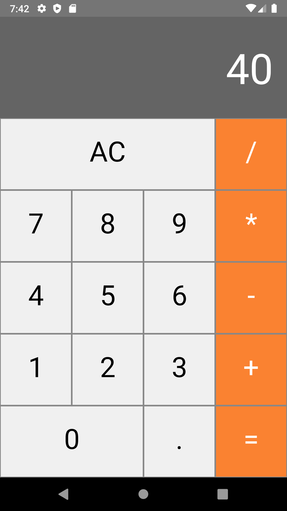

<h1 align="center">
 
Calculator
</h1>

Calculator project created using React Native.

  

  

## Features

- All simples calculator functions.

- ⚛️ **React Native** — A lib that provides a way to create native apps for Android and iOS

## Getting started

- Clone project > enter the project folder
- run `yarn`
- run `yarn android`

## License

This project is licensed under the MIT License - see the [LICENSE](https://opensource.org/licenses/MIT) page for details.

---

Created with passion by me 👨🏻‍💻
